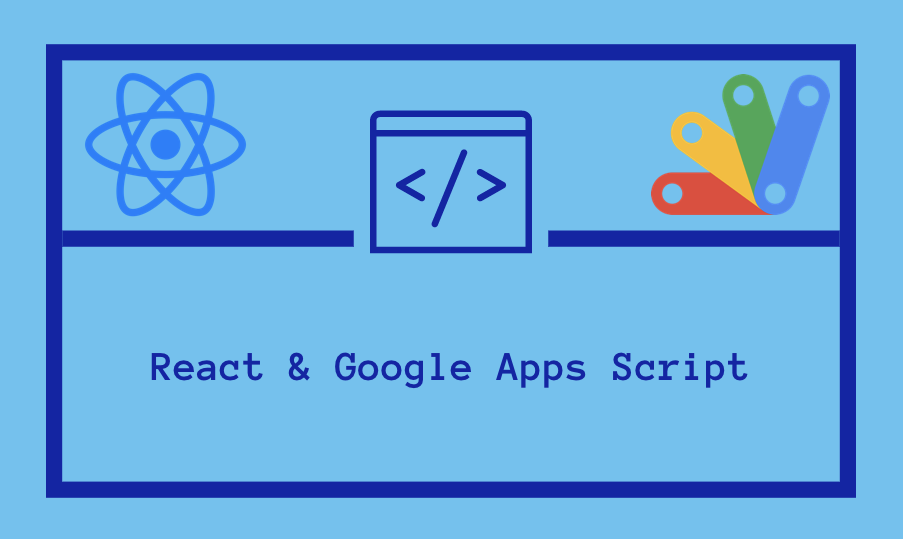

# Lyon Text 2

  <p align="center">
  <a href="" rel="noopener">
 </a>
  <a href="" rel="noopener">
 </a>
 </p>

## Table of Contents

- [About](#about)
- [Local Development](#local-development)
  - [Prerequisites](#prerequisites)
  - [Setup](#setup)
- [Test](#test)
- [Deploy](#deploy)

<p align="center">
This repo is a Google Apps Script Project on top of Google Sheets that allows you to send text messages to rows of people inside a Google Sheet. It is originally a fork of <a href="https://github.com/enuchi/React-Google-Apps-Script">this repo</a> but has been modified heavily. This application is written entirely in TypeScript, and utilizes <a href="https://react.dev/">React</a> for its UI alonside packages such as <a href="https://react-redux.js.org/">React Redux</a>, <a href="https://mui.com/">Material UI</a>, <a href="https://postcss.org/">PostCSS</a>, and many many others. Tests, including integration tests with Google Sheets, have been written with <a href="https://jestjs.io/">Jest</a> and <a href="https://pptr.dev/">Pupeteer</a>  
</p>

<br/>

## About

This application produces a dialog that allows users to send text messages to people in rows of a google sheet:

<p align="center">
 
</p>

This Google Workbook must have two two sheets within.

1. Roster
2. Sent

The first MUST be named "Roster" and MUST Have these columns (in any order, and extra columns are okay) as follows:

<table style="font-family: arial, sans-serif; border-collapse: collapse; width: 100%; background-color: #dddddd; color: #000">
  <tr style="border: 1px solid black; text-align: left; padding: 8px;">
    <th style="border: 1px solid black; text-align: left; padding: 8px;">First Name</th>
    <th style="border: 1px solid black; text-align: left; padding: 8px;">Last Name</th>
    <th style="border: 1px solid black; text-align: left; padding: 8px;">Office</th>
    <th style="border: 1px solid black; text-align: left; padding: 8px;">Ninja</th>
    <th style="border: 1px solid black; text-align: left; padding: 8px;">Role</th>
  </tr>
  <tr>
</table>
<table>

See Screenshot:

<p align="center">
 
</p>

It will contain all the people you wish to send messages to.

There also MUST be a second sheet caled "Sent." This sheet may be blank. It's columns and fields will be populated automatically.

See Screenshot:

<p align="center">
 
</p>

You send messages by opening the dialog (Top Menu -> Messaging -> Send SMS), and filling out the form. The options available in the form are generated based upon the values in the `Roster` sheet. After sending messages, the sent messages are both displayed in the dialog, as well as written to the `Sent` sheet.

## Local Development

### Prerequisites

- Make sure you're running at least [Node.js](https://nodejs.org/en/download/) >= v18.16.0 and `npm` >= v9.6.5.

- You'll need to enable the Google Apps Script API. You can do that by visiting [script.google.com/home/usersettings](https://script.google.com/home/usersettings).

- [google clasp](https://github.com/google/clasp#deployments) installed

- To use live reload while developing, you'll need to serve your files locally using HTTPS. See below for how to set up your local environment.

- You must have a Sheet in the workbook named "Roster" with the following columns:

  - `First Name`, `Last Name`, `Office`, `Ninja`, `Role`

- You must have a Sheet in the workbook named "Sent." This sheet can be blank.

- You must make an `.env` file and fill most of the values in from `.env.example`

  - This includes having <a href="https://www.twilio.com/">Twilio</a> Account credentials
  - This includes having a google test account for integration testing with <a href="https://jestjs.io/">Jest</a> and <a href="https://pptr.dev/">Puppeteer</a>

### Setup

<br/>

**1.** First, let's clone the repo and install the dependencies.

```bash
git clone https://github.com/robquinn/lyon-text2
cd lyon-text2
npm install
```

**2.** Next, we'll need to log in to [clasp](https://github.com/google/clasp), which lets us manage our Google Apps Script projects locally.

```bash
npm run clasp:login
```

**3.** You will need two Google Sheets. One is for testing, and the other is the production environment. You will not need to update the values of `.clasp.json`, however, you will need to update all the values in your `.env` file based on the values in `.env.example`. Values from `.env` are injected into `.clasp.json` by when running command like `npm run start` and others.

**4.** You will need to generate certificates for local development. We can develop our client-side React apps locally, and see our changes directly inside our Google Spreadsheet dialog window.

Install the mkcert package:

```bash
# mac:
brew install mkcert

# windows:
choco install mkcert
```

[More install options here.](https://github.com/FiloSottile/mkcert#installation)

Then run the mkcert install script:

```bash
mkcert -install
```

Create the certs in your repo:

```bash
npm run certs:setup
```

**5.** Build and deploy code the to the development Google sheet.

```bash
npm run start
```

**6.** You need to deploy the web app in order to get a URL for Twilio's `StatusCallback` url:

```bash
npm run deploy:dev
```

You need to take the WebApp URL and place it in the `.env` file for `TWILIO__DEV__STATUS_CALLBACK` for development, and `TWILIO__PROD__STATUS_CALLBACK` for production

## Test

To run the tests:

```bash
npm run test
```

To run the integration tests:

```bash
npm run test:integration
```

To run the extended integrations tests:

```bash
npm run test:integration:extended
```

## Deploy

To deploy the app to the production sheet:

```bash
npm run push:prod
```

Then, you need to deploy the web app in order to get a URL for Twillio's `StatusCallback`:

```bash
npm run deploy:prod
```

You need to take the WebApp URL and place it in the `.env` file for `TWILIO__LIVE__STATUS_CALLBACK`
